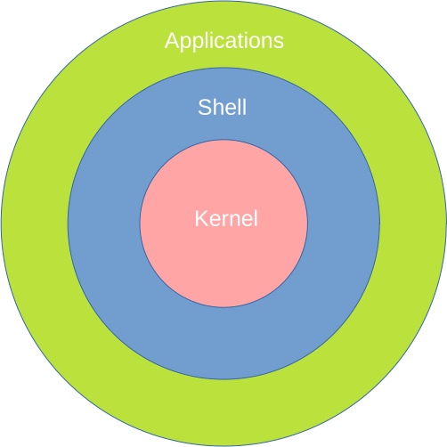

```{r setup, include=FALSE}
knitr::opts_chunk$set(echo = FALSE)
```

## Bash - Bourne again shell

* Is a Unix shell:
  - GNU implementation of the Bourne shell (sh) from 1979
  - can be seen as interface between the user and the operating system (OS)
  - users interact with the shell using a terminal emulator (e.g. direct or via ssh)
  - interactive command language and a scripting language

* Other sh like shells: {width=250px, align='right'}
  - **zsh**, ksh, ash


## Bash basic features

* filename wildcarding \
    <center>
    `*.{png,jpg}`
* piping
    - `cmd1 | cmd2 | ... | cmdN`
* here documents \
    `cat << EOF` \
    `line1` \
    `line2` \
    `EOF`
* command substitution \
    <center>
    ```
    gzip `grep ".fastq" filelist.txt`
    ```
    \
    or \
    `gzip $(grep ".fastq" filelist.txt)`

## Bash basic features
* variables \
    <center>
    `VAR="foo"; echo $VAR`
* control structures for condition-testing \
  <center>
  ```if [ $FOO == $BAR ]; then ... fi```
  
* iteration (loops)
    <center>
    ` for ((i=1; i<=10; i++)); do echo Hello $i; done` \
    or \
    `i=1; while [ $i -le 10 ]; do echo Hello $i; ((i++)); done`

## Bash config files
Config files contain commands that are executed when loaded

| file                | loaded on |
|---------------------|---------|
| `/etc/profile`      | login   |
| `/etc/bashrc`       | login   |
| `~/.profile`        | login   |
| `~/.bash_profile`   | login   |
| `~/.bash_login`     | login   |
| `~/.bash_logout`    | login, executed on logout  |
| `~/.bashrc`         | interactive + n/login |

## Bash config files
Important and useful settings

* `$PATH` variable
  - `~/.bash_profile`
  - environment variable
  - specifies a set of directories where executable programs are located
  - program will be run from the first directory it is found in

e.g. \
<font size="4">
`$ echo $PATH` \
`$ /usr/local/bin:/usr/bin:/bin:/usr/sbin:/home/gringo/bin:/opt/pycharm/bin`
</font>

## Bash config files
Important and useful settings

* `$JAVA_HOME`
  - directory in which JRE is installed
* `$LD_LIBRARY_PATH`
  - path to system and program libraries
* `$HISTSIZE` variable
  - specifies how many commands are saved in history \
  `$ echo $HISTSIZE`\
  `$ 1000`
* `$EDITOR`
  - sets the default text editor (e.g. nano, mcedit)

variables are set w/o leading `$`, e.g.\
<font size="4">
`$ JAVA_HOME=/usr/java/jdk/1.12/` \
</font>


## Aliases
Unix shells allow aliasing commands, that is replacing a command by an arbitrary
string.

Used to abbreviate commands or add default options to a command, e.g.:

  * `alias l='ls -la'`
  * `alias tsv='column -t -s$'\''\t'\'`

*Hint*: to persist your aliases set them in `~/.bash_profile`

To remove an alias use:

  * `unalias <alias>`


## Aliases
To alias a command that should get an argument passed we can use bash functions()

e.g.\

```bash
mkcd() {                                                                                                                                                                                                
    local d="$1"                                                                                                                                                                                                  
    mkdir -p $d
    cd $d
}
```

Would use the first argument to create directory and directly change into it

`$ mkcd /tmp/a/b/c` \
`$ pwd` \
`$ /tmp/a/b/c` \

## Help me or RTFM

Most UNIX programs have a manual page to document the options
for the command

  * manual page can be accessed using \
  `$ man <program name>` \
  e.g. \
  `$ man cat`
  * will display detailed usage, options and examples for cat
  * man pages usually have the following sections:
<font size="4">
    - NAME
    - SYNOPSIS
    - DESCRIPTION
    - EXAMPLES
    - AUTHOR, REPORTING BUGS, COPYRIGHT, SEE ALSO
  
</font>

