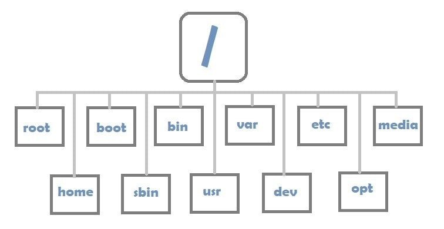
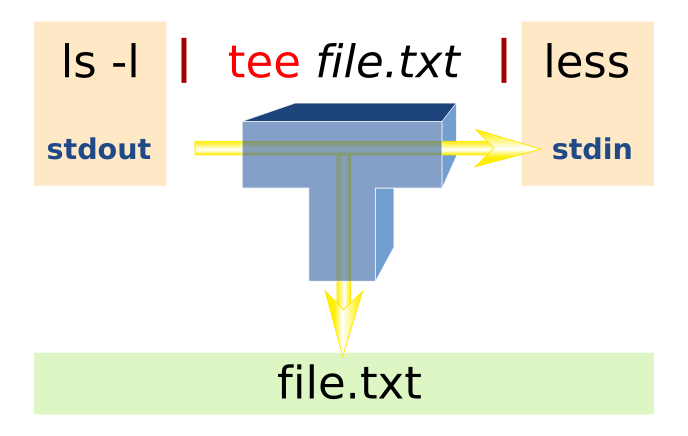

```{r setup, include=FALSE}
knitr::opts_chunk$set(echo = FALSE)
```

## Housekeeping

From next week on, we will start with student presentations. 
You can either present

 * a Bioinformatics method
 * a cool R or Python package
 * your own code (we will review it together)

We will send around a google sheet where you can enter your topic. 
If you don't choose a topic, we will assign one. 

## Command line completion

Interacting with the OS using the command line implies a lot of typing:

  * long paths to input files
  * program arguments
  
Typing is cumbersome and prone to errors

  * Bash offers auto completion of:
    - paths
    - programs names
    - program options

  * Command line completion is achieved by typing a partial path/program and
  then pressing the **TAB** key (to the left of Q)


## Accessing history / edit commands

 * Up and down arrows keys
 * **Ctrl + R**: search your history
 
To move to the beginning of the current line, use **[Ctrl][A]** \
To move to the end of the current line, use **[Ctrl][E]** \
To move forward one word on the current line, use **[Alt][F]** \
To move backwards one word on the current line, use **[Alt][B]** \

You can also use key commands to do more than **move** around on the current line. They can be used to **manipulate** text on the current line as well.

To clear the characters on the line before the current cursor position, use **[Ctrl][U]** \
To clear the characters on the line after the current cursor position, use **[Ctrl][K]**


## The Unix filesystem

The Unix file system is a hierarchical tree of directories.

  * The filesystem root is: **/**
  * There are no drive letters as in Windows
  * Storage devices may be mounted into any place of the filesystem tree
  * No file extensions required but they are helpful (.fastq, tar.gz)
  
{width=500px, align='center'}

## Addressing files in the filesystem

Addressing files by their full or absolute path

  `/home/gringo/Documents/document1.txt`
  `/home/gringo/scripts/script.sh`


Addressing files by relative paths

  `$ cd /home/gringo/scripts` \
  `$ ls -l ../Documents/document1.txt` \
  <center><font size="4">equals to \
  `/home/gringo/Documents/document1.txt`</font></center> \
  `$ ls -l ../../` (?)


## Addressing files in the filesystem

Some shortcuts

  * `~ `  : tilde - the current user's home directory \
  <font size="4">`$ cd ~/scripts`</font>
  * `. `  : single dot - the current directory \
  <font size="4">`$ ./script.sh`</font>
  * `..`  : double dot - one directory above the current directory \
  <font size="4">`$ cd ../Documents`</font>
  * `cd -`: change to the previous directory
  * `pwd` : print full path of current directory
  * `pushd` : change + remember dir in directory stack \
  <font size="4">`$ pushd .`</font>
  * `popd` : return to last remembered dir in stack
  * `dirs` : show dir stack


## Wildcards

 * Wildcard are provided by the shell
 * allow a quick addressing of multiple files in a single operation
 
 * Different types of wildcards
  - `*` ... any number of characters
  - `?` ... single any character
  - `{<a>,<b>,<..>}` ... choice of a,b,...


## Wildcards examples

```bash
  $ ls -1 data/s*.fastq.gz
  data/sample_a.fastq.gz
  data/sample_ab.fastq.gz
  data/sample_b.fastq.gz
  data/sub_sample_x.fastq.gz
```

```bash
  $ ls data/sample_??.fastq.gz
  data/sample_ab.fastq.gz
```

```bash
  $ ls data/s*_{a,x}.fastq.gz
  data/sample_a.fastq.gz data/sub_sample_x.fastq.gz
```

```bash
  $ ls data/reads_R{1,2}.fastq.gz
  data/reads_R1.fastq.gz data/reads_R2.fastq.gz
```

  
## Soft links / Hard links

Sometimes it is required or useful to have a copy of a file
in another location, e.g. shorter path or program requirement.\
\
However, copying files is often problematic

  * duplicates data
  * is often slow (big files)
  * changes are not propagated

To avoid this we can use "virtual copies" named *links*


## Soft links / Hard links

  * Soft links (symbolic link, symlink)
  <font size="4">
    - visible as a link, but can still be used as if it is a file
    - is a filename pointing to another filename
    - work for files and directories
    - work across filesystem devices
    - when "original" is moved, renamed, deleted, the link is **dead**
    
  </font>
  
  <font size="4">   
  `$ ln -s <path to real file> <path to link>`\
  `$ ln -s /data/projects/2021/myPrj ~/myPrj` \
  `$ ls -l myPrj` \
  `$ lrwxrwxrwx 1 gringo users 20 Oct 7  2021 myPrj -> /data/projects/2021/myPrj` \
  `$ cd myPrj; pwd` \
  `$ /home/gringo/myPrj` \
  `$ pwd -P` or `$ realpath .`\
  `$ /data/projects/2021/myPrj`
  
  </font>


## Soft links / Hard links


  * hard links
  <font size="4">
    - indistinguishable from a copied file
    - is a filename pointing to the same data as the original 
    - work only for files not directories
    - work only on same filesystem device
    - "original" can be moved, renamed, deleted
  
  </font>

  <font size="4">
  `$ ls -l myFile.txt` \
  `$ -rw-r--r-- 1 gringo users 11 Oct  7 13:40 myFile.txt` \
  `$ ln <path to real file> <path to link>`\
  `$ ln myFile.txt myLink.txt` \
  `$ ls -l my*.txt` \
  `$ -rw-r--r-- 2 gringo users 11 Oct  7 13:40 myFile.txt` \
  `$ -rw-r--r-- 2 gringo users 11 Oct  7 13:40 myLink.txt` \

  </font>


*Note*: Every file is basically a hard link to the data


## Some basic file commands
 
 * `cd `, `pwd`, `mkdir`, `rmdir`
 * `touch`, `rm`, `ls`, `mv`
 * `tar xvf`, `tar cvf`, `tar xzvf`, `tar czvf`
 * `gzip`, `gunzip`, `pigz`, `bgzip`
 * `cp`, `ln`, `ln -s`
 * `rsync`
 * `tree`
 * `which`, `find`, `locate`

 
## Viewing files
 * `cat`, `zcat` shows entire content file (compressed)
 * `tac` shows entire content in reverse order
 * `less` scroll through file
 * `head` shows first (10, or -\<x\>) lines of file
    - <font size="4">`head file.txt` or `head -2 file.txt`</font>
 * `tail` shows last (10, or -\<x\>) lines of file
    - <font size="4">`tail file.txt` or `tail -2 file.txt` or `tail -n+2` </font>
 * `sort` shows sorted file, type, key(s) and direction
    - <font size="4">`sort file.txt` or `sort -k1,1 -k3,3n file.txt`</font>
 * `diff` shows differences between files
 * `wc` line, word, character counter


## Filtering files
 * `cut` shows specified columns
    - <font size="4">`cut -f2,5 file.txt` or `cut -d"," -f3-6 file.txt`</font>
 * `grep` filters file by expression
    - <font size="4">`grep Foo file.txt`</font>
    - <font size="4">`grep '^>' sequences.fasta` or `grep -v '^>' sequences.fasta`</font>
    - <font size="4">`grep -v '^$' file.txt`</font>
 * `uniq` shows unique/duplicate lines only (needs sorting)
    - <font size="4">`uniq file.txt`</font>
    - <font size="4">`uniq -d file.txt`</font>
    - <font size="4">`sort -u file.txt`</font>


## Editing files or streams
 * `sed` stream editor
   - `sed -i -r 's/>\ />/g' seq.fasta`
 * `tr` translate characters 
   - `tr "ATGC" "TACG"`
 * `rev` reverse strings
 * `paste` merge lines of files
 * `awk` powerful pattern scanning and processing language
 * `shuf` write lines of file in random order


## The fun starts here

What can we do with all these (and tons of other) tools?

 * Record their output
 * Get the error status
 * Knit them together to build "pipelines"
 * Running them over batches of files

 
## Input/Ouput/Error streams

POSIX<font size="4">*</font> has 3 standard data streams:

 * 0 `STDIN`: Standard Input, can send data to a program
 * 1 `STDOUT`: Standard Output, output data from a program
 * 2 `STDERR`: Standard Error, errors/warnings from a program


{width=450px, align='center'}


<font size="4">*Portable Operating System Interface: API in Unix</font>


## Redirecting Standard Streams

Streams can be redirected using arrows

 * `> filename` Redirects STDOUT (`>>` appends)
 * `< filename` Redirects STDIN
 * `2> filename` Redirects STDERR
 * `2>&1` Sends STDERR to STDOUT results in one output stream
 * `> /dev/null` Sends output to the data Nirvana

```bash
$ ls -1 *.fastq.gz > fastq_list.txt
$ cat fastq_list.txt
sample_1.fastq.gz
sample_2.fastq.gz
[...]

$  program sample_1.fastq.gz > result.txt 2> error.txt
$  program sample_1.fastq.gz > result.txt 2>&1
```

## Pipes

This is the Unix philosophy:\

 * Write programs that do one thing and do it well
 * Write programs to work together
 * Write programs to handle text streams, because that is a universal interface.


{width=300px, align='right'}


 <font size="4">
``
$ cat file.txt | grep -v "^$" | sort k2,2n 
``
</font>


<font size="4">
``
$ grep  ">" seq.fasta | tr -d ">" > out.txt
``
</font>

<font size="4">
``
$ cat seq.fasta | rev | tr "ACGT" "TGCA" > rev_comp.fasta
``
</font>


## Named pipes

Named pipes also known as *FIFO*:

 * *F*irst *I*n, *F*irst *O*ut principle
 * extension for traditional pipe concept
 * in contrast to unnamed pipes they use the filesystem
 * `mkfifo` creates the FIFO
 * do not consume disk space

Two separate processes can access the pipe by name
one process can open it as a **reader**, and the other as a **writer**.


## Named pipes example
 

```bash
$ mkfifo R1
$ mkfifo R2
$ yara_mapper -e 3 -t 4 -f bam y_idx reads_R1.fq reads_R2.fq | \
    samtools view -@ 4 -h -F 4 -b1 | \
    tee R1 R2 > /dev/null &
    samtools view -@ 2 -h -f 0x40 -b1 R1 > mapped_1.bam &
    samtools view -@ 2 -h -f 0x80 -b1 R2 > mapped_2.bam &
wait
rm -f R1 R2
```

<font size="4">
`tee` reads standard input and writes it to both standard output and one or more files, effectively duplicating its input
</font>

{width=250px, align='center'}

