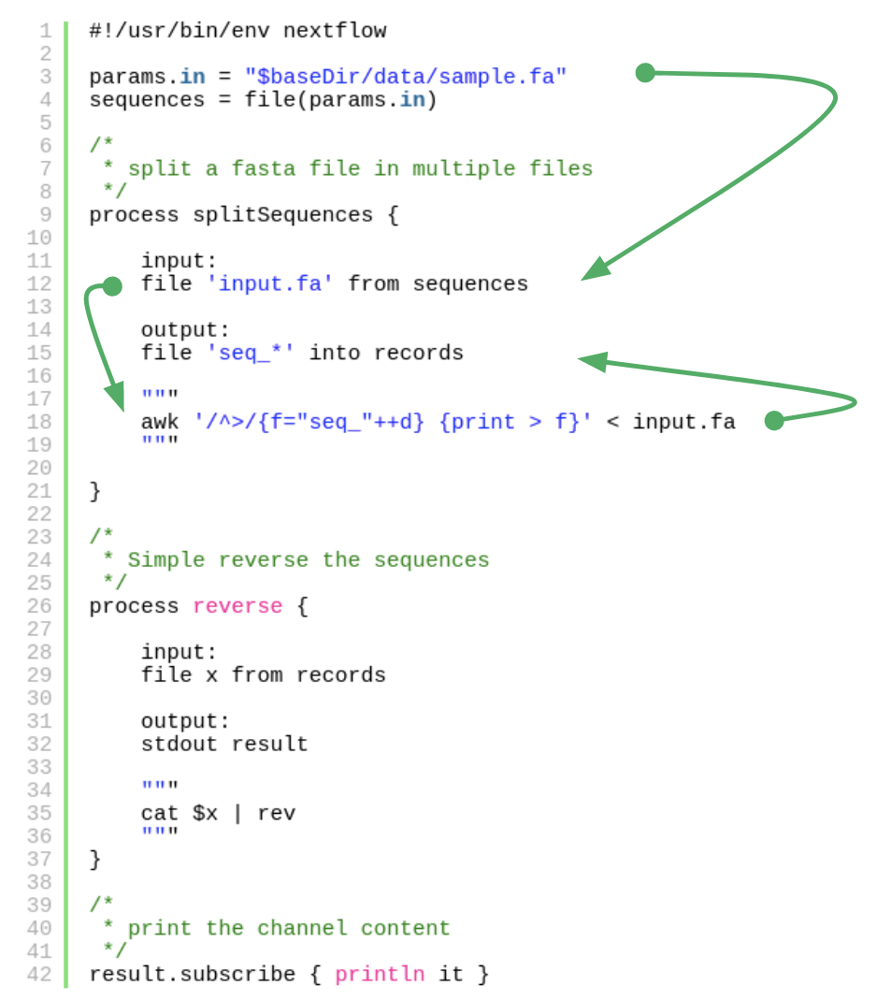

## Software engineering for data science

* Challenges
{width=150px, align='right'}
  - Workflows / Pipelines consist of different tools
  - dozens of individual methods
  - Software dependencies
  - Complex dependency trees and configuration requirements
  - HPC resource management
  - Scalability - performance optimization
  - Reproduce results with older data / integrate with newer data
  
  
## Challenges / Solution

<center>
\
`When faced with a challenge,` \
`look for a way not for a way out` \
             David L. Weatherford
</center>
\
\
\

<center>
{width=450, align='center'}
<center>
\
A custom DSL (domain-specific language)
for building reproducible computational workflows and pipelines


## Nextflow - Features {width=150, align='right'}

<center>
`Nextflow is built around the concept that`\
`Linux is the lingua franca of data science`
</center>
\

it allows:

* Fast prototyping
  - write a computational pipeline by making it simpler to put together many different tasks
  - reuse your existing scripts and tools
  - **extend** with a powerful **DSL**
  - “no” need to learn a new language or API


## Nextflow - Features {width=150, align='right'}

* Reproducibility and isolation of dependencies
<font size="4">
  - supports **Docker** and **Singularity** containers technology
  - supports **Conda** envs: easy and automatic software installation
  - integration of the **GitHub** code sharing platform

</font>


```nextflow
process {
  conda 'bwa samtools multiqc'
  ...
}
```
```nextflow
process {
  container 'quay.io/biocontainers/bedtools:2.30.0--h7d7f7ad_2'
  ...
}
docker.enabled = true
```
```bash
$ nextflow run nextflow-io/hello -r v1.1
```

## Nextflow - Features {width=150, align='right'}
  

it is portable:

* abstraction layer between pipeline's logic and the execution layer
* can be executed on multiple platforms without changing its code
* SGE, LSF, SLURM, PBS and HTCondor batch schedulers
* Kubernetes, Amazon AWS and Google Cloud platforms.

```nextflow
process {
  executor = 'sge'
  queue = 'long.q'
  
  cpus = 2
}

```

## Nextflow - Features {width=150, align='right'}

it has _unified parallelism_:

* based on the dataflow programming model
* greatly simplifies writing complex distributed pipelines
* Parallelisation is implicitly defined by the processes input and output declarations.
* The resulting applications are inherently parallel and can scale-up or scale-out

it comes with _continuous checkpoints_:

* all the intermediate results are automatically tracked
* can resume from the last successfully executed step


## Nextflow - Basics {width=150, align='right'}


Processes

* A Nextflow pipeline is joining together different processes
* A process can be written in any scripting language (Bash, Perl, Ruby, Python, etc.)
* Processes are executed independently and are isolated from each other, i.e. they do not
share a common (writable) state.


## Nextflow - Basics {width=150, align='right'}


Channels

* Processes communicate is via asynchronous FIFO queues, called channels in Nextflow.
* Any process can define one or more channels as input and output.
* The interaction between these processes, and ultimately the pipeline execution flow itself,
is implicitly defined by these input and output declarations.
* Parallelisation is implicitly defined by the processes input and output declarations


## Nextflow - Basics {width=150, align='right'}

Execution abstraction

* A process defines what command or script has to be executed
* The executor determines how it is run on the target system
* By default processes are executed on the local computer (good for testing)
* real world computational pipelines run on an HPC or cloud platform

* Nextflow provides an abstraction between the pipeline and the underlying
execution system.


## Nextflow - Basics {width=150, align='right'}

Execution abstraction

* Write a pipeline once and seamlessly run it on your computer, a grid
platform, or the cloud, without modifying it, by simply defining the target
execution platform in the configuration file.

Nextflow supports:

* SGE, LSF, SLURM, PBS, Torque, HTCondor
* Amazon Web Services (AWS), Google Cloud Platform (GCP), Kubernetes


## Nextflow - Basics {width=150, align='right'}


Scripting language

* Nextflow is designed to have a minimal learning curve
* In most cases, standard scripting skills to develop Nextflow workflows are fine.
* It also provides a powerful scripting DSL.
* Nextflow scripting is an extension of Groovy, which is a super-set of Java

```groovy
x = Math.random()
if( x < 0.5 ) {
    println "You lost."
}
else {
    println "You won!"
}
```

## Nextflow - Basics {width=150, align='right'}


Configuration options

* Pipeline configuration is defined in `nextflow.config`

<font size=4>
e.g. : executors, containers/Envs, environment variables, pipeline parameters etc.
</font>

```nextflow
params {
  resultDir = "/data/results"
  genome = "/data/hg38/genome.fasta"
}
process {
  withName:BWA {
    cpus = 8
    container = "quay.io/biocontainers/bwa:0.7.17--h5bf99c6_8"
  }
}
singularity {
    enabled = true
}
```


## Nextflow - Example {width=150, align='right'}


{height=550, align='middle'}

## Nextflow - Example {width=150, align='right'}


{height=550, align='middle'}

## Nextflow - Links {width=150, align='right'}


Documentation:

* https://www.nextflow.io/docs/

Learning:

* https://www.nextflow.io/blog/2020/learning-nextflow-in-2020.html

Pipeline repositories:

* https://nf-co.re/ {width=150, align='right'}
* https://gitlab.i-med.ac.at/icbi-lab/pipelines

