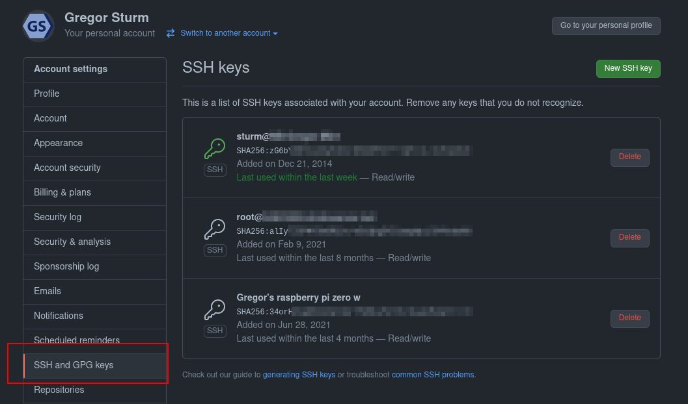

## Git for collaboration 

* Backup your code
* Synchronize between laptop and HPC
* Git is an industry standard
* Collaborate with others
* Share your code


<style type="text/css">img { max-width: 100% }</style>


## Setting up GitHub or GitLab

There are two protocols to use with git: https and ssh

```bash
# HTTPS
git clone https://github.com/icbi-lab/current-topics-bioinformatics-lecture.git
# ssh
git clone git@github.com:icbi-lab/current-topics-bioinformatics-lecture.git
```

We recommend using ssh as it allows to set-up passwordless authentication. 


## Passwordless authentication

Generate a ssh key-pair. It consists of a public and a private key.

 * Keep the private key secret (i.e. in your home directory only)
 * you can share the public key with anyone (e.g. with GitHub)
 * Everyone who possesses the public key can check if a message was signed using corresponding private key, thereby verifying your identity. 
 
```bash
# Generate a key-pair. Hit enter 3x to use
# default settings and no additional password. 
ssh-keygen

# display the public key
cat ~/.ssh/id_rsa.pub
```

---




## Using remotes


## A git repository...

...is just a folder with a special `.git` directory. 

<br />

Create a repository by typing

```bash
git init
```

within a directory. 

## The four git states

Display modified files and their states:
```bash
git status
git diff
```

Add a modified file to the *staging area*:
```bash
git add <FILE>
```

Commit all *staged* files:
```bash
git commit
```

Browse history
```bash
git log
```

## Working with branches

List branches
```
git branch -v
```

Create a new branch from current commit
```
git branch <NAME>
```

Switch to another branch
```
git switch <NAME>
```

## Ignoring files

Create a file named `.gitignore` in the git repository.

Example: 

```
.Rhistory
.RData

*.nb.html
plots/*.pdf
```

## Configuring git

Configuration file at `~/.gitconfig`. Modify with text-editor or with `git config` command. 

When collaborating online, it is important to set your identity -- it will be associated with every commit: 

```bash
git config --global user.name "Your name"
git config --global user.email "mail@example.com"
```


## Links

 * [ICBI Gitlab (for internal projects)](gitlab.i-med.ac.at)
 * [ICBI GitHub (for published projects)](github.com/icbi-lab)
 * [Git Cheatsheet by GitLab](https://about.gitlab.com/images/press/git-cheat-sheet.pdf)
 