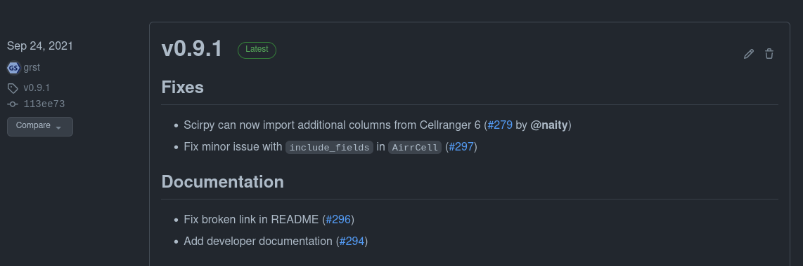

## Git for collaboration 

* Backup your code
* Synchronize between laptop and HPC
* Git is an industry standard
* Collaborate with others
* Share your code


<style type="text/css">img { max-width: 100% }</style>


## Setting up GitHub or GitLab

There are two protocols to use with git: https and ssh

```
# HTTPS
git clone \
  https://github.com/icbi-lab/current-topics-bioinformatics-lecture.git
  
# ssh
git clone \
  git@github.com:icbi-lab/current-topics-bioinformatics-lecture.git
```

We recommend using ssh as it allows to set-up passwordless authentication. 


## Passwordless authentication

Generate a ssh key-pair. It consists of a public and a private key.

 * Keep the private key secret (i.e. in your home directory only)
 * you can share the public key with anyone (e.g. with GitHub)
 * Everyone who possesses the public key can check if a message was signed using corresponding private key, thereby verifying your identity. 
 
```bash
# Generate a key-pair. Hit enter 3x to use
# default settings and no additional password. 
ssh-keygen

# display the public key
cat ~/.ssh/id_rsa.pub
```


## Add public key to GitHub


## Using remotes

 * different users can point to the same remote
 * the same repo can point to multiple remotes (e.g. GitHub and GitLab)

List remotes
```bash
git remote -v
```

Add a remote
```bash
# per convention, the default remote is called "origin"
git remote add origin \
  git@github.com:icbi-lab/current-topics-bioinformatics-lecture.git

# but you can have other remotes as well
git remote add my-fork \
  git@github.com:grst/current-topics-bioinformatics-lecture.git
```

## Pull/Push

Push to a remote
```bash
# git push <remote> <branch>
git push origin master
git push my-fork master
```

Pull from a remote
```bash
git pull origin master
```

Set a default remote for current branch
```bash
git push -u origin master
# now just use git pull/push without branch and remote
git push
```

## Tags and Releases

* A tag marks a certain commit in a repository
* Use this for creating versions of your tool or your analysis
* Take a look at [semantic versioning](https://semver.org/lang/de/) for choosing version numbers. 

```bash
# create a tag
git tag v0.1.0

# sync it with a remote
git push --tags
```

## Releases

* Releases are a feature of GitHub/GitLab and work on top of tags
* They
  - make a tag more visible
  - allow you to store additional information




## Issues and Pull-requests

The typical open-source collaboration workflow:

 * open an issue (bug report or feature request)
 * Someone creates a pull-request 
 * The maintainer reviews and merges the pull-request
 * The issue is closed

--- 
 
Example from `nf-core/modules`:

 * Issue [#854](https://github.com/nf-core/modules/issues/854)
 * Pull-request [#975](https://github.com/nf-core/modules/pull/975)

Example from `icbi-lab/scirpy`:

 * Issue [#279](https://github.com/icbi-lab/scirpy/issues/279)
 * Pull-request [#290](https://github.com/icbi-lab/scirpy/pull/290)

## Why do code reviews? 

 * Find mistakes and ensure code quality
 * Discuss different implementations
 * Distribute knowledge of the code base ([bus factor](https://en.wikipedia.org/wiki/Bus_factor))
 * **learn from each other**
   - As a novice reviewer, ask questions (-> [blog post](https://medium.com/pinterest-engineering/how-to-review-code-as-a-junior-developer-10ffb7846958))
 
## Use issues and project-boards to organize your project


https://github.com/icbi-lab/scirpy/projects/1

 
## Continuous integration (CI)

 * run a script at every `git push`
 * used for 
    - automated tests
    - deploying releases
    
The course website uses CI to automatically build
slides from Rmarkdown documents. See 
 
 * [`.github/workflows/render_yml.yml`](https://github.com/icbi-lab/current-topics-bioinformatics-lecture/blob/master/.github/workflows/render_rmd.yml)
 * [`render_all.sh`](https://github.com/icbi-lab/current-topics-bioinformatics-lecture/blob/master/render_all.sh)


## Further reading
 * [Learn git in Y minutes](https://learnxinyminutes.com/docs/git/)
 * [First time contributor's guide by GitHub](https://github.com/firstcontributions/first-contributions)
 * [Hallmarks of Good Scientific Software](https://grst.github.io/bioinformatics/2020/07/16/hallmarks-scientific-software.html)
 * [How to Make Your Code Reviewer Fall in Love with You](https://mtlynch.io/code-review-love/)
 * [How to Review Code as a Junior Developer](https://medium.com/pinterest-engineering/how-to-review-code-as-a-junior-developer-10ffb7846958)


