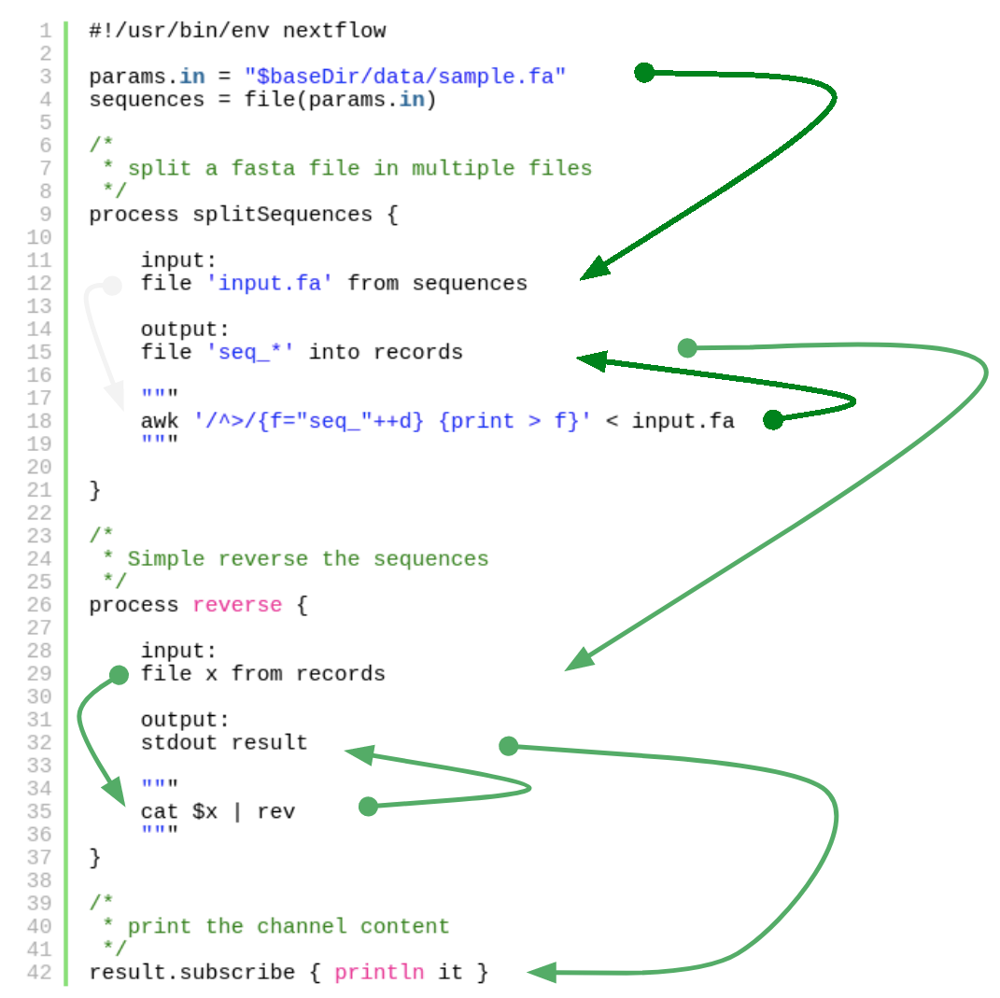
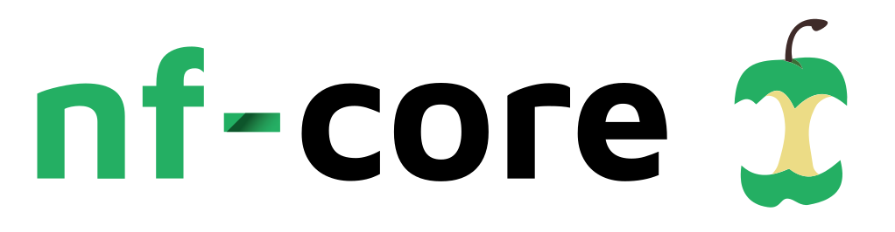

## Nextflow - Recap {width=150, align='right'}

* Main features
  - Domain specific language (DSL) for pipeline development
  - Reproducible workflows
  - Isolation of dependencies (conda, containers)
  - Portable - execution abstraction (local, SGE, AWS, ...)
  - Parallelization is implicit
  - Use your scripting skills + DSL (i.e. groovy)


* Nextflow pipelines consist of

  - Channels (asynchronous FIFO queues)
  - Processes
  - Config


## Nextflow - Recap {width=150, align='right'}


{height=550, align='middle'}

## Nextflow DSL2 {width=150, align='right'}


Nextflow DSL2 is major evolution of the Nextflow language

* New features
  - Functions
  - Modules
  - Subworkflows
  - enables the reuse of workflow components
  - reuse of Channels


To enable DSL 2 use the following declaration at the top of the script:

```nextflow
nextflow.enable.dsl=2
```


## Nextflow DSL2 - functions {width=150, align='right'}


```nextflow
def <function name> ( arg1, arg, .. ) {
    <function body>
}
```

For example:

```nextflow
def foo() {
    'Hello world'
}

def bar(alpha, omega) {
    alpha + omega
}
```

<font size=4>
Functions implicitly return the result of the last evaluated statement. \
_explicit_: ```return <val>```
</font>


## Nextflow DSL2 - modules {width=150, align='right'}


A **module** is a **Nextflow script** containing one or more **process definitions** that can be **imported** from another Nextflow script.

\
<center>Difference to legacy syntax</center>
\

In DSL2 the **process is not bound with specific input and output channels**.\
\
```from``` and ```into``` channel declaration have to be omitted.

The new DSL separates the definition of a process from its invocation. 


## Nextflow DSL2 - modules  {width=150, align='right'}

<font size=4>A process can be invoked as a function in the ```workflow``` scope,
passing the expected input channels as parameters as it if were a custom function.
</font>

```nextflow
process bar {
    input:
      path x
    output:
      path 'bar.txt'
    script:
      """
      your_command $x > bar.txt
      """
}

workflow {
    data = channel.fromPath('/some/path/*.txt')
    bar(data)
}
```


## Nextflow DSL2 - modules  {width=150, align='right'}

Module components can be imported using the ```include``` keyword.

<div class="small2">
<style type="text/css">.small2 pre { font-size: 20px; line-height: 20px }</style>
```nextflow
include { foo } from './some/module'

workflow {
    data = channel.fromPath('/some/data/*.txt')
    foo(data)
}
```
</div>

Multiple inclusion

<div class="small2">
<style type="text/css">.small2 pre { font-size: 20px; line-height: 20px }</style>
```nextflow
include { foo; bar } from './some/module'

workflow {
    data = channel.fromPath('/some/data/*.txt')
    foo(data)
    bar(data)
}
```
</div>

## Nextflow DSL2 - modules  {width=150, align='right'}

Process outputs can either be assigned to a variable or accessed using the implicit ```.out``` attribute

```nextflow
include { INDEX; FASTQC; QUANT; MULTIQC } from './module/script.nf' 

read_pairs_ch = channel.fromFilePairs( params.reads)

workflow {
  INDEX( params.transcriptome )
  FASTQC( read_pairs_ch )
  QUANT( INDEX.out, read_pairs_ch )
  MULTIQC( QUANT.out.mix(FASTQC.out).collect(), multiqc_file )
}
```
<font size=4>
_Note_: channels may now be used as inputs multiple times without the need to duplicate them
</font>


## Nextflow DSL2 - named output  {width=150, align='right'}


use the **`emit`** option to define a name identifier
that can be used to reference the channel in the external scope.

```nextflow
process foo {
  output:
    path '*.bam', emit: samples_bam

  '''
  your_command --here
  '''
}

workflow {
    foo()
    foo.out.samples_bam.view()
}
```

## Nextflow DSL2 - module aliases  {width=150, align='right'}

<font size=4>
... inclusion and invocation of components with the same name from different modules
</font>

```nextflow
include { foo } from './some/module'
include { foo as bar } from './other/module'

workflow {
    foo(some_data)
    bar(other_data)
}
```
<font size=4>
... inclusion and the invocation of the same component multiple times
</font>

```nextflow
include { foo as foo_a; foo as foo_b } from './some/module'

workflow {
    foo_a(some_data)
    foo_b(other_data)
}
```

## Nextflow DSL2 - parameters  {width=150, align='right'}

Define one or more parameters in the module

```nextflow
params.foo = 'Hello'
params.bar = 'world!'

def sayHello() {
    println "$params.foo $params.bar"
}
```
Parameters are inherited from the including context
```nextflow
params.foo = 'Hola'
params.bar = 'Mundo'

include {sayHello} from './some/module'

workflow {
    sayHello()
}
```


## Nextflow DSL2 - sub-workflows  {width=150, align='right'}

In DSL 2 syntax sub-workflow libraries can be defined.

<font size=4>
- sub-workflows can be used in the same way as processes \
- include and reuse multi-step workflows as part of larger workflows
</font>

* Requirements:
<font size=4>
    - workflow name
    - inputs using the new ```take``` keyword
    - outputs using the new ```emit``` keyword

</font>

```nextflow   
workflow subworkflow_name {
    take: data
    main:
        foo(data)
        bar(foo.out)
    emit:
        bar.out
}
```

## Nextflow DSL2 - workflow {width=150, align='right'}

Workflows defined in your script or imported by a module inclusion can be invoked and composed as any other process in your application.

<div class="small">
<style type="text/css">.small pre { font-size: 16px; line-height: 16px }</style>
```nextflow
workflow flow1 {
    take: data
    main:
        foo(data)
        bar(foo.out)
    emit:
        bar.out
}

workflow flow2 {
    take: data
    main:
        foo(data)
        baz(foo.out)
    emit:
        baz.out
}

workflow {
    take: data
    main:
      flow1(data)
      flow2(flow1.out)
}
```
</div>


## Nextflow - Links {width=150, align='right'}


Documentation:

* https://www.nextflow.io/docs/


Pipeline repositories:

* https://nf-co.re/ {width=150, align='right'}
* https://gitlab.i-med.ac.at/icbi-lab/pipelines

