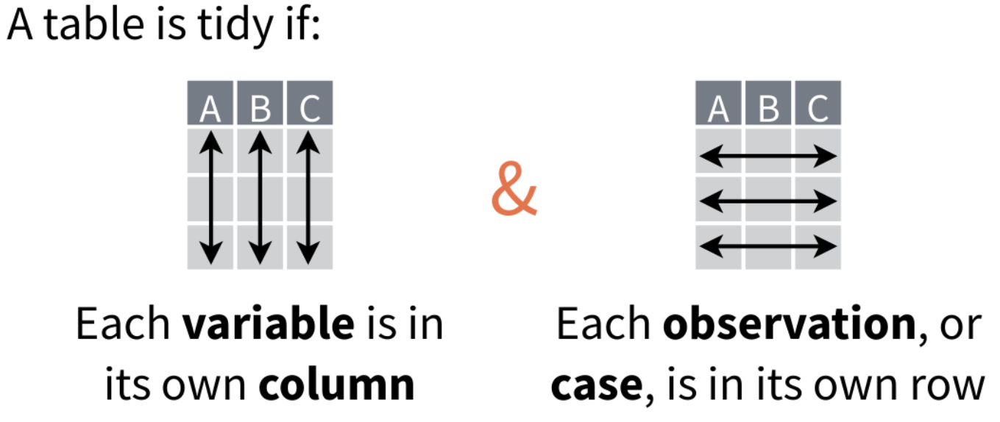
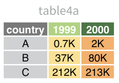
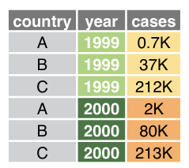
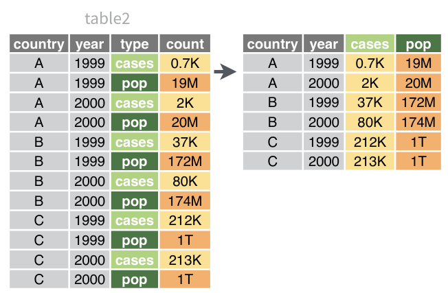

## Why tidy data? 

> “Tidy datasets are all alike, but every messy dataset is messy in its own way.” –– Hadley Wickham

<br>

Introducing the `tidyverse`:

```{r, message=FALSE, warning=FALSE, results='hide'}
library(tidyr)   # cleaning
library(dplyr)   # wrangling 
library(ggplot2) # plotting
```

```{r, include=FALSE}
iris = as_tibble(iris)
```

## Tibbles

```{r, include=FALSE}
options(tibble.print_max=4, tibble.print_min=3)
```

 * opinionated improvement of `data.frame`
 * does not have rownames
 * can have arbitrary column names
 * consistent behavior
 * pretty printing
 
```{r}
tibble(A=1:1000, `log10(TPM+1)` = log1p(1:1000))
```

<!--

`read_csv`, `read_tsv`, etc. from the `readr` package produce tibbles by default. 

dataframe to tibble

```
as_tibble(df, rownames="new_col")
```

tibble to dataframe
```
df |> column_to_rownames("a_column") |> as.data.frame()
```
-->

## Pipes

**Use pipes**
```r
df |>
  select(A) |>
  filter(A == 42) |>
  mutate(B=A*2)
```

**Don't** read your code backwards
```r
mutate(filter(select(df, A), A == 42), B=A*2)
```

**Don't** waste your time inventing variable names
```r
df_subset <- select(df, A)
df_filtered <- filter(df_subset, A == 42)
final_df <- mutate(df_filtered, B=A*2)
```

## Tidy data

<style type="text/css">
img {
  max-width: 100%
}
</style>




## Tidying data: `pivot_longer`



## Tidying data: `pivot_longer`


```{r, results='hide'}
table4a |> 
  pivot_longer(cols=-country, values_to="cases", names_to="year")
```


 
## Tidying data: `pivot_wider`



```{r, results='hide'}
table2 |>
  pivot_wider(names_from="type", values_from="count")
```

## Tidying data: `separate`

```{r, results='hide'}
markers = tibble(
  id=c("patient1_cell1", "patient1_cell2", "patient2_cell1", "patient2_cell2"),
  markers=c("CD8A", "CD45_CD8A", "CD45_CD4_FOXP3", "CD4")
)
```

```{r}
markers |> 
  separate(id, into=c("patient", "cell")) |>
  separate_rows("markers", sep="_")
```


## Select data

* `select`: choose some columns
* `filter`: choose some rows

```{r}
iris2 <- iris |> 
  select(sepal_length=Sepal.Length, sepal_width=Sepal.Width, Species) |>
  filter(Species %in% c("setosa", "virginica"))
```

## Modify data: `mutate`

```{r}
iris2 |> 
  mutate(sepal_length_in = sepal_length / 25.4)
```


## Modify data: `group_by` + `summarise`
```{r}
iris2 |> 
  group_by(Species) |> 
  summarise(max_length = max(sepal_length), mean_length = mean(sepal_length), n_samples=n())
```

## Combining data

* `bind_rows`: concatenate two dataframes with same columns
* `bind_cols`: concatenate two dataframes with same rows

### Inner join 

* `inner_join(x, y)`
* `inner_join(x, y, by="key")`
* `inner_join(x, y, by=c("key_x"="key_y"))`

### More joins
* `left_join`, `right_join`
* `full_join`

See [understanding joins](https://r4ds.had.co.nz/relational-data.html#understanding-joins) for nice illustrations. 


## Further Reading & Credits

Examples are taken from the following resources:

 * [dplyr cheatsheet by Rstudio](https://raw.githubusercontent.com/rstudio/cheatsheets/main/data-transformation.pdf)
 * [tidyr cheatsheet by Rstudio](https://raw.githubusercontent.com/rstudio/cheatsheets/main/tidyr.pdf)
 
For more details, I recommend reading:

 * [tidy data in R4DS by Hadley Wickham](https://r4ds.had.co.nz/tidy-data.html)