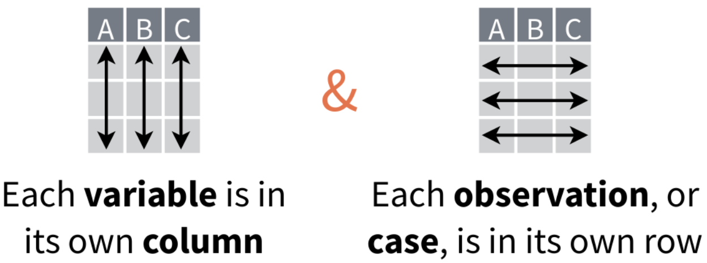
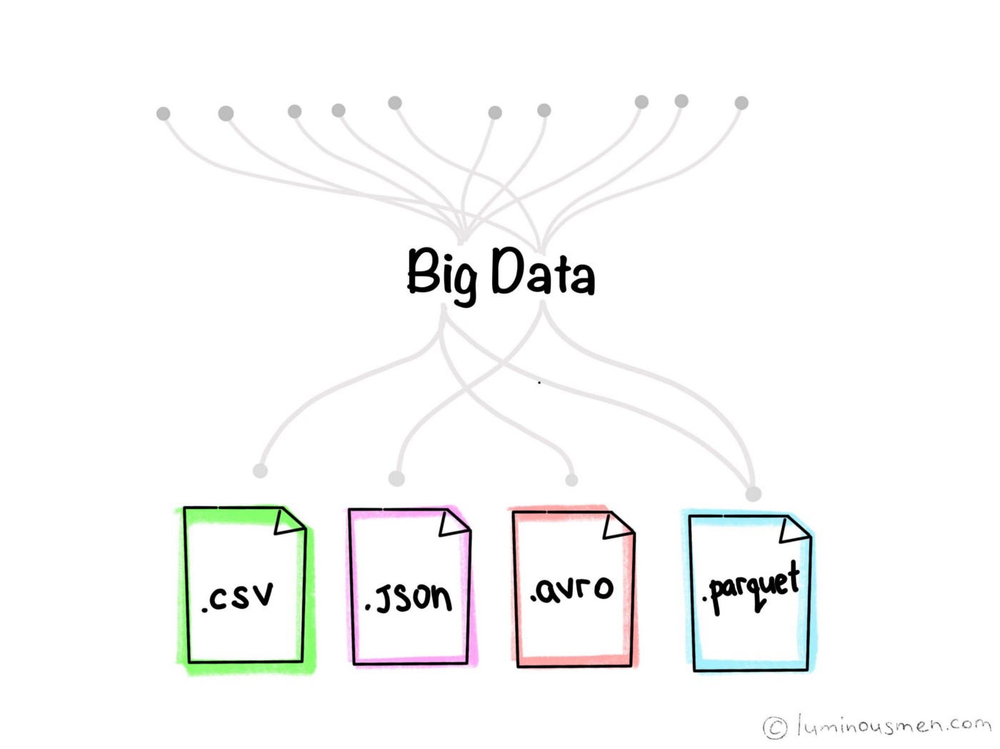

## Data formats

What is a data format?

When working with data, e.g. gene expression, annotations, mutations, analysis results we need a proper way to store it

  - in memory while working on it
  - on disk for later use


There are different formats one can use


## Data formats


Pandas DataFrame

```python
import pandas as pd

dataset = pd.DataFrame(
    data={
        'string' : ('apple', 'banana', 'carrot'),
        'integer': (0, 1, 2),
        'float'  : (0.0, 1.1, 2.2),
    },
)
```


{width=450, align='left'} This DataFrame's data is in the tidy data format


## Data formats

NumPy arrays

```python
import numpy as np

np.array([7, 2, 9, 10])
np.array([ [5.2, 3.0, 4.5], [9.1, 0.1, 0.3] ])
np.array([ [ [1, 4, 7], [2, 9, 7], [1, 3, 0], [9, 6, 9] ],
           [ [2, 3, 4], [1, 2, 5], [3, 6, 2], [4, 7, 8] ] ])
```

{width=500, align='center'}


## Data formats


NumPy arrays are different from Pandas DataFrame:

  - NumPy stores data as one contiguous block
  - the whole NumPy array must have one data type
  - Pandas DataFrames store data as individual columns
  - Pandas columns are actually numpy arrays
  - the DataFrame my have columns of different data types

{width=500, align='left'}


## Data formats

**Question:**

Can we store these datasets in a file in a way that keeps the data format intact?

**Answer:**

We need a file format that supports our chosen data format to do so.


Pandas an NumPy support and integrate many different file formats: e.g.

<https://pandas.pydata.org/docs/user_guide/io.html>
<https://numpy.org/doc/stable/reference/routines.io.html>


## Data formats

What to look for in a file format?

Remember the following:

  - There is no file format that is good for every use case.
  - There are various standard file formats for various use cases.

{width=400, align='center'}

## Data formats

Consider the following:

  - if a certain format is used by many others in my field, maybe there is reasons for using it.
  - is the file format good for my data format (is it fast/space efficient/easy to use)?
  - do I need a human-readable format or is it ok to work on it using programming languages?
  - do I want to archive / share the data or do I just want to store it while I’m working?


## Data formats: CSV/TSV

    - Type: Text format
    - Packages needed: numpy, pandas, csv
    - Space efficiency: Bad
    - Good for sharing/archival: Yes
    - Tidy data:
        - Speed: Bad
        - Ease of use: Great
    - Array data:
        - Speed: Bad
        - Ease of use: Ok for one/two dimensional data.
                       Bad for anything higher.
    - Best use cases: Sharing data. Small data. 
      Data that needs to be human-readable.

CSV is the most popular file format, as it is human-readable and easy to share.\
But, does not preserve data types. Not standardized.

## Data formats: CSV/TSV

Pandas

<div class="small2">
<style type="text/css">.small2 pre { font-size: 20px; line-height: 20px }</style>
```python
dataset.to_csv('dataset.csv', index=False)
dataset_csv = pd.read_csv('dataset.csv')
```
</div>

NumPy

<div class="small2">
<style type="text/css">.small2 pre { font-size: 20px; line-height: 20px }</style>
```python
np.savetxt('data_array.csv', data_array)
data_array_csv = np.loadtxt('data_array.csv')
```
</div>

CSV

<div class="small2">
<style type="text/css">.small2 pre { font-size: 20px; line-height: 20px }</style>
```python
import csv
with open('dataset.csv', newline='') as csvfile:
  csvreader = csv.reader(csvfile, delimiter=',', quotechar='"')
  for row in csvreader:
    ...

with open('dataset.csv', 'w', newline='') as csvfile:
    csvwriter = csv.writer(csvfile, delimiter=',', quotechar='"')
    csvwriter.writerow(['A', 'B', 'C'])
    ...
```
</div>


## Data formats: JSON

    - Type: Text format
    - Packages needed: None (json-module is included with Python).
    - Space efficiency: Ok.
    - Good for sharing/archival: OK
    - Tidy data:
        - Speed: Ok
        - Ease of use: Ok
    - Array data:
        - Speed: Ok
        - Ease of use: Ok
    - Best use cases: Saving Python objects for debugging.

JSON is often used to represent hierarchical data with multiple layers or multiple connections.
\
JSON is standardized (ISO standard) and preserves data types.
However, when you’re working with big data, you rarely want to keep your data in this format.\


## Data formats: Feather

    - Type: Binary format
    - Packages needed: pandas, pyarrow
    - Space efficiency: Good
    - Good for sharing/archival: No
    - Tidy data:
        - Speed: Great
        - Ease of use: Good
    - Array data:
        - Speed: -
        - Ease of use: -
    - Best use cases: Temporary storage of tidy data.

Feather is a file format for storing data frames quickly. There are libraries for Python, R and Julia


## Data formats: Parquet

    - Type: Binary format
    - Packages needed: pandas, pyarrow
    - Space efficiency: Great
    - Good for sharing/archival: Yes
    - Tidy data:
        - Speed: Good
        - Ease of use: Great
    - Array data:
        - Speed: Good
        - Ease of use: It’s complicated
    - Best use cases: Working with big datasets in tidy data format.

Parquet is a standardized open-source columnar storage format (C, Java, Python, MATLAB, Julia, etc.)


## Data formats: HDF5

    - Type: Binary format
    - Packages needed: pandas, PyTables, h5py
    - Space efficiency: Good for numeric data.
    - Good for sharing/archival: Yes, if datasets are named well.
    - Tidy data:
        - Speed: Ok
        - Ease of use: Good
    - Array data:
        - Speed: Great
        - Ease of use: Good
    - Best use cases: Working with big datasets in array data format.

HDF5 is a high performance storage format for storing large amounts of data in multiple datasets
in a single file.


## Data formats: Pickle

    - Type: Binary format
    - Packages needed: None (pickle-module is included with Python).
    - Space efficiency: Ok.
    - Good for sharing/archival: No! See warning below.
    - Tidy data:
        - Speed: Ok
        - Ease of use: Ok
    - Array data:
        - Speed: Ok
        - Ease of use: Ok
    - Best use cases: Saving Python objects for debugging.


Pickle is Python’s own serialization library. It allows you to store Python objects into a binary file.

<font size=4>
**Attention:** Loading pickles that have been provided from untrusted sources is risky as they can contain arbitrary executable code
</font>


## Data formats: Excel

    - Type: Binary format
    - Packages needed: openpyxl
    - Space efficiency: Bad.
    - Good for sharing/archival: Maybe.
    - Tidy data:
        - Speed: Bad
        - Ease of use: Good
    - Array data:
        - Speed: Bad
        - Ease of use: Ok
    - Best use cases: Sharing data in many fields. Quick data analysis.
                      Manual data entry.


Excel is very popular in social sciences and economics. However, it is **not** a good format for data science.
<font size=4><https://www.kristianbrock.com/post/send-me-data/></font>

## Data formats: summary
<div class="small2">
<style type="text/css">.small2 pre { font-size: 20px; line-height: 20px }</style>
Text formats

    - pros:
        - human readable
        - easy sharing
    - cons:
        - poor performance
        - space usage

Binary formats

    - pros:
        - can represent floating point numbers with full precision
        - save space
        - good reading and writing performance
        - multiple datasets in one file
        - working with large data
    - cons:
        - not all are good for sharing
        - not human readable
</div>
## Data formats - Links

Links and references

* https://aaltoscicomp.github.io/python-for-scicomp/data-formats/
* https://pandas.pydata.org/docs/user_guide/io.html
* https://numpy.org/doc/stable/reference/routines.io.html
* https://parquet.apache.org/documentation/latest/
* https://arrow.apache.org/docs/python/feather.html
* https://www.hdfgroup.org/solutions/hdf5/

